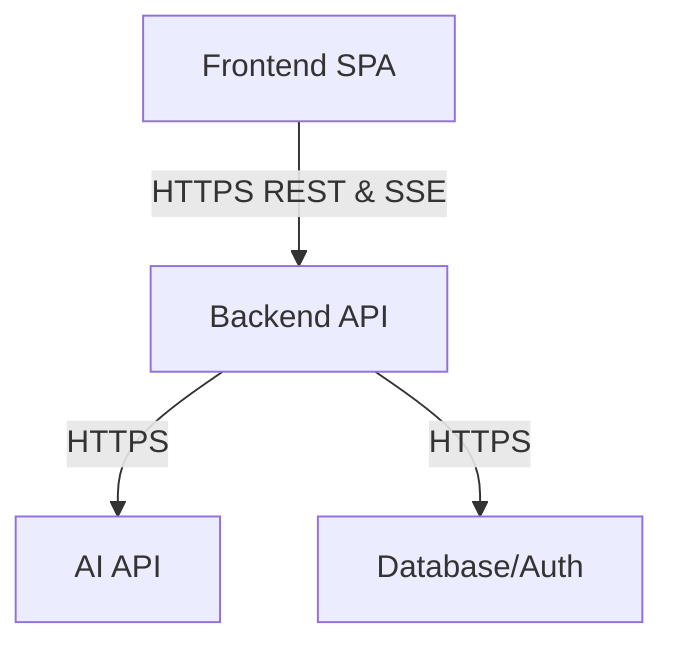

# Briefly – System Architecture

## Document Information
- **Title:** Briefly System Architecture
- **Version:** 1.0
- **Status:** Approved
- **Date:** 2026-08-06
- **Author:** Pavan

## 1. Tech Stack

Briefly follows a secure three-tier client/server architecture. The backend manages protected credentials and orchestrates integrations, while the frontend delivers a responsive user interface.

| Layer | Technology | Responsibility |
|---|---|---|
| **Frontend** | React, Vite, Tailwind CSS | Delivers the user interface, client-side routing, and real-time streaming preview. |
| **Backend** | Node.js, Express, TypeScript | Provides a secure, stateless API to orchestrate business logic and third-party integrations. |
| **Database** | Supabase PostgreSQL | Persists user data and generated meeting briefs securely. |
| **Authentication** | Supabase Auth | Manages user identities and validates session JWTs. |
| **AI** | Anthropic Claude API | Processes context to generate structured meeting intelligence. |
| **Validation** | Zod | Enforces strict schema and character limits on all incoming requests. |
| **Testing** | Vitest, Supertest | Executes backend unit and integration test suites. |

## 2. Components

### Frontend SPA
- **Responsibility:** Provides the interactive user interface for context capture, brief history viewing, and real-time generation previews.
- **Key Inputs:** User interaction, HTTP responses, Server-Sent Events (SSE).
- **Key Outputs:** HTTP requests, UI rendering.
- **Dependencies:** React, Vite, Tailwind CSS.

### Authentication / Session Layer
- **Responsibility:** Manages secure user login, registration, and session token generation via a managed identity provider.
- **Key Inputs:** Email, password credentials.
- **Key Outputs:** Authenticated session states, JWTs.
- **Dependencies:** Supabase Auth SDK.

### Backend API
- **Responsibility:** Serves as the central orchestration engine, handling routing, rate limiting, and request delegation.
- **Key Inputs:** HTTP requests from the frontend.
- **Key Outputs:** HTTP responses, SSE streams.
- **Dependencies:** Node.js, Express, express-rate-limit.

### Authentication Middleware
- **Responsibility:** Intercepts incoming backend requests to verify the presence and validity of a JWT before allowing access to protected routes.
- **Key Inputs:** HTTP `Authorization` headers.
- **Key Outputs:** Validated user objects attached to the request, or a 401 Unauthorized response.
- **Dependencies:** Supabase Admin SDK.

### Brief Service / Data-Access Layer
- **Responsibility:** Executes secure CRUD operations against the database while strictly enforcing ownership isolation for every query.
- **Key Inputs:** Authenticated user IDs, validated brief payloads, UUIDs.
- **Key Outputs:** Inserted, updated, or retrieved brief records.
- **Dependencies:** Supabase PostgreSQL.

### AI Prompt Builder
- **Responsibility:** Sanitises validated user inputs and securely constructs the targeted system and user prompts for the AI model.
- **Key Inputs:** Validated meeting context, optional parent brief context.
- **Key Outputs:** Formatted prompt strings.
- **Dependencies:** None (Internal business logic).

### AI Generation / Streaming Layer
- **Responsibility:** Invokes the external AI API and progressively parses the response chunks into an SSE stream for the frontend.
- **Key Inputs:** Constructed prompts.
- **Key Outputs:** Streaming JSON chunks, final generated text.
- **Dependencies:** Anthropic SDK.

### Response Validation
- **Responsibility:** Ensures all incoming HTTP request bodies and parameters conform to strict character limits and type schemas before processing.
- **Key Inputs:** Raw request payloads.
- **Key Outputs:** Parsed, type-safe data objects or 400 Bad Request errors.
- **Dependencies:** Zod.

### Database
- **Responsibility:** Provides relational, persistent storage for meeting briefs and user metadata.
- **Key Inputs:** SQL commands and data payloads.
- **Key Outputs:** Query result sets.
- **Dependencies:** PostgreSQL (managed via Supabase).

### Error-Handling Layer
- **Responsibility:** Catches unexpected exceptions centrally, preventing server crashes and returning sanitised error messages that hide internal stack traces from the client.
- **Key Inputs:** Application errors, validation errors.
- **Key Outputs:** Formatted JSON error responses (e.g., 500 Internal Server Error).
- **Dependencies:** Express error-handling middleware.

## 3. Data Model

The application utilises a relational data model focused on users and their generated meeting intelligence. 

### User
- **Purpose:** Represents an authenticated individual interacting with the system.
- **Important Conceptual Fields:** `id` (UUID), `email`.
- **Relationships:** One-to-many with Meeting Briefs.
- **Ownership Rules:** Managed internally by Supabase Auth; application code relies on the authenticated `id` extracted from the verified JWT.

### Meeting Brief
- **Purpose:** Stores the raw inputs provided by the user alongside the structured intelligence generated by the AI.
- **Important Conceptual Fields:** `id` (UUID), `title`, `objective`, `agenda`, `context`, `attendees`, `previous_notes`, `generated_brief` (JSON structure), `created_at`.
- **Relationships:** Belongs to one User. May optionally self-reference another Meeting Brief (Parent).
- **Ownership Rules:** Every brief requires a `user_id`. Ownership isolation is enforced at the application level; every backend database query explicitly appends `.eq('user_id', req.user.id)`. This guarantees users cannot access, update, or delete briefs they do not own.

### Parent/Follow-up Self-Reference
- **Purpose:** Allows a new meeting brief to explicitly link to a past meeting to maintain continuity.
- **Important Conceptual Fields:** `parent_brief_id` (UUID).
- **Relationships:** A brief can have zero or one parent brief.
- **Ownership Rules:** The backend validates that the provided `parent_brief_id` belongs to the authenticated user before allowing it to be used as context for a follow-up generation.

## 4. API Design

### GET `/api/health`
- **Method:** GET
- **Path:** `/api/health`
- **Authentication:** Public (None required)
- **Request:** No parameters or body.
- **Response:** `200 OK` returning `{ "status": "ok", "timestamp": "..." }`.

### GET `/api/auth/me`
- **Method:** GET
- **Path:** `/api/auth/me`
- **Authentication:** Required (JWT)
- **Request:** No parameters or body.
- **Response:** `200 OK` returning `{ "id": "<uuid>", "email": "..." }`.

### GET `/api/briefs`
- **Method:** GET
- **Path:** `/api/briefs`
- **Authentication:** Required (JWT)
- **Request:** No parameters or body.
- **Response:** `200 OK` returning an array of brief objects owned by the user, sorted newest first.

### GET `/api/briefs/:id`
- **Method:** GET
- **Path:** `/api/briefs/:id`
- **Authentication:** Required (JWT)
- **Request:** Path parameter `id` (UUID).
- **Response:** `200 OK` returning the full brief object. Returns `404 Not Found` if missing or unowned.

### POST `/api/briefs`
- **Method:** POST
- **Path:** `/api/briefs`
- **Authentication:** Required (JWT)
- **Request:** JSON body containing title, objective, agenda, optional context fields, and a complete `generatedBrief` object.
- **Response:** `201 Created` returning the saved brief object.

### PUT `/api/briefs/:id`
- **Method:** PUT
- **Path:** `/api/briefs/:id`
- **Authentication:** Required (JWT)
- **Request:** Path parameter `id` (UUID). JSON body containing fields to update.
- **Response:** `200 OK` returning the updated brief object.

### DELETE `/api/briefs/:id`
- **Method:** DELETE
- **Path:** `/api/briefs/:id`
- **Authentication:** Required (JWT)
- **Request:** Path parameter `id` (UUID).
- **Response:** `204 No Content` upon successful deletion.

### POST `/api/briefs/generate`
- **Method:** POST
- **Path:** `/api/briefs/generate`
- **Authentication:** Required (JWT)
- **Request:** JSON body containing title, objective, agenda, optional context fields, and an optional `parentBriefId` (UUID). The backend verifies the parent brief belongs to the authenticated user before proceeding.
- **Response:** `200 OK` with `Content-Type: text/event-stream`. This is an SSE streaming endpoint that returns `chunk` events as text is generated, followed by a `complete` event containing the saved brief's ID, or an `error` event upon failure.

## 5. Implementation Sequence

The project was constructed in a logical order to ensure security and stability prior to building advanced features. The implementation sequence reflects the actual Git repository history:

1. **Project foundation / scaffold:** Configured the monorepo structure, initialised Vite (Frontend) and Express (Backend), and established TypeScript, linting, and environment variables. *Why: Established the baseline tooling and strict typing necessary for all subsequent development.*
2. **Authentication:** Integrated Supabase Auth on the frontend and implemented JWT verification middleware on the backend. *Why: Identity and secure routing are prerequisites before any private user data can be captured or stored.*
3. **Database schema and secure CRUD:** Created the PostgreSQL schema for briefs, built the Zod validation layer, and implemented backend data-access routes with strict ownership filtering. *Why: Ensures data persistence and multi-tenant security are locked down before introducing complex AI integrations.*
4. **AI generation and streaming:** Integrated the Anthropic SDK, engineered prompts, and built the Server-Sent Events (SSE) streaming pipeline. *Why: Generating briefs is the core value proposition, but required the established secure backend to safely hold API keys.*
5. **Frontend workflow:** Built out the React UI, dashboard, forms, and SSE streaming parsers to consume the backend API. *Why: The UI relies entirely on the underlying secure data and streaming infrastructure being operational.*
6. **Capstone testing and security validation:** Implemented comprehensive Vitest unit and Supertest integration testing (achieving 97 passing backend tests) alongside a thorough security audit. *Why: Validates that the assembled components function safely, reliably, and as designed under various scenarios.*
7. **Documentation and final deployment verification:** Finalised architectural, API, and project documentation (including this document) confirming the running state of the application. *Why: Ensures all deliverables accurately reflect the fully built and verified system rather than speculative plans.*

## 6. Risks

| Risk | Potential Impact | Existing Mitigation |
|---|---|---|
| **1. AI output reliability / hallucination** | The AI may produce malformed, unhelpful, or schema-invalid briefs, leading to poor meeting preparation. | The backend enforces schema validation on the AI output; malformed outputs are not persisted as valid briefs. However, complete prevention of semantic hallucinations is impossible; users must review generated content. |
| **2. Authentication and ownership-isolation failure** | Users might access, modify, or delete briefs belonging to other users, resulting in critical data breaches. | The backend explicitly enforces ownership filtering by appending `.eq('user_id', req.user.id)` on all database queries. Unauthenticated requests are immediately rejected by middleware. |
| **3. Third-party dependency availability, quota and cost** | Overuse or abuse of the Anthropic API could exhaust quotas or incur massive costs, breaking the core feature. | Strict rate limiting is applied (20 generation requests per 15 mins per IP). Server-side secret containment ensures API keys are never exposed to the client. |
| **4. Streaming connection interruption** | The SSE connection could drop mid-generation, leaving the user without a brief and wasting backend processing. | AbortControllers immediately terminate the upstream Anthropic generation request if the client disconnects, preventing runaway processes. The UI degrades gracefully. |
| **5. External service or database failure** | Supabase or Anthropic may experience downtime, preventing logins or generation. | A centralised error-handling layer catches external faults, returning sanitised error messages (e.g., "generation failed") to the user while keeping internal provider errors hidden, allowing the UI to present a recoverable state. |
