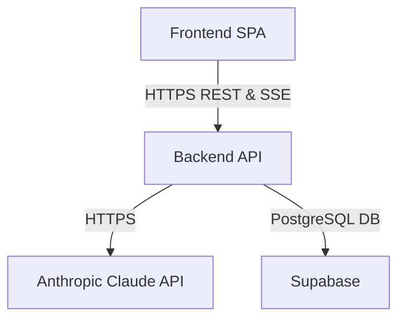

# Briefly – System Architecture

## Document Information
- **Title:** Briefly System Architecture
- **Version:** 1.0
- **Status:** Approved
- **Date:** 2026-08-06
- **Author:** Pavan

## 1. Architecture Overview
Briefly is a web-based meeting intelligence application built to ingest meeting context and produce structured briefing documents. The system follows a standard three-tier client/server architecture. The frontend is a static Single Page Application (SPA) that provides the user interface, session management, and real-time streaming preview. The backend is a stateless API layer that serves as the secure orchestration engine, validating all incoming data, enforcing data ownership, and managing protected credentials. 

When a user submits a meeting context, the frontend sends a request to the backend. The backend validates the input, constructs a system prompt, and securely calls the Anthropic AI service. The AI's response is streamed back to the backend, which parses it, streams it to the frontend via Server-Sent Events (SSE), and then persists the completed brief in the Supabase PostgreSQL database. This separation ensures that sensitive API keys and administrative database credentials never reach the client, while delivering a responsive, low-latency experience to the user.

## 2. High-Level Architecture

## 3. Component Architecture

### Frontend
- **Purpose:** Provides the user interface and captures meeting inputs.
- **Responsibilities:** Session management, form validation, routing, rendering streaming updates.
- **Inputs:** User interaction, backend API responses, SSE streams.
- **Outputs:** HTTP requests to the backend API.
- **Dependencies:** React, Vite, Tailwind CSS.

### Backend API
- **Purpose:** Central orchestration and security enforcement.
- **Responsibilities:** Validating requests, enforcing rate limits, constructing AI prompts, streaming SSE, persisting data.
- **Inputs:** HTTP requests from Frontend.
- **Outputs:** HTTP responses, SSE streams, database queries, Anthropic API calls.
- **Dependencies:** Express, Node.js, Zod, Anthropic SDK, Supabase Admin SDK.

### AI Generation Service
- **Purpose:** Generates structured meeting briefs from raw context.
- **Responsibilities:** Processing prompts and returning generated content via streaming chunks.
- **Inputs:** Prompts constructed by the backend.
- **Outputs:** Text chunks forming a structured brief.
- **Dependencies:** Anthropic Claude API.

### Authentication
- **Purpose:** Manages user identity and access.
- **Responsibilities:** Registering users, issuing JWTs, validating sessions.
- **Inputs:** Email and password.
- **Outputs:** Authenticated application session.
- **Dependencies:** Supabase Auth.

### Database
- **Purpose:** Persists meeting briefs and user records.
- **Responsibilities:** Storing structured brief data and ensuring data integrity.
- **Inputs:** Insert, update, and delete queries from the backend.
- **Outputs:** Query results.
- **Dependencies:** Supabase PostgreSQL.

## 4. Request Lifecycle

1. **User login** establishes a secure session via Supabase Auth.
2. **Meeting form submission** captures user context and sends an HTTP POST request to the backend.
3. **Validation** occurs via Zod to ensure the request meets strict length and type requirements.
4. **Authentication** middleware verifies the JWT against Supabase.
5. **Rate limiting** ensures the request does not exceed the allowed IP threshold.
6. **Prompt construction** sanitises the input and maps it into a targeted system prompt.
7. **Streaming generation** calls the Anthropic API and forwards the Server-Sent Events (SSE) chunks to the frontend.
8. **Persistence** saves the complete generated brief to the Supabase database.
9. **History retrieval** fetches the brief via a standard REST GET request upon subsequent visits.
10. **Display** renders the historical brief on the frontend dashboard.

## 5. Security Architecture

- **Authentication:** Handled by Supabase Auth with JWT verification at the backend middleware layer.
- **Ownership enforcement:** The backend explicitly appends exact user ID checks to all queries; cross-user access attempts return generic 404 errors to prevent leakage.
- **Server-side secrets:** Supabase service-role keys and Anthropic API keys are strictly contained within the backend process and never exposed to the client.
- **Validation:** All incoming requests undergo strict Zod schema validation (character limits and type checking) before processing.
- **Rate limiting:** Express rate limiting is enforced globally per IP and specifically on generation endpoints.
- **Central error handling:** Unexpected failures are caught by a central error handler that sanitises messages, ensuring stack traces and provider errors are never returned to the client.
- **Sensitive data protection:** API calls strictly wrap user inputs in XML tags, treating them as untrusted passive data to mitigate prompt injection.

## 6. Data Architecture

- **Major entities:** Users and Meeting Briefs.
- **Relationships:** One-to-many (One User has many Meeting Briefs); Meeting Briefs may have a self-referential relationship (Follow-up Brief links to Parent Brief).
- **Persistence:** Stored in a managed Supabase PostgreSQL relational database.
- **Ownership:** Every brief strictly maps to a single owner's user identifier, guaranteeing logical separation of data.

## 7. API Architecture

- **REST endpoints:** Standard CRUD operations for briefs.
- **Streaming endpoint:** Dedicated generation endpoint maintains an open connection, transmitting SSE chunks as AI generates content.
- **Authentication requirements:** All non-health endpoints require a valid JWT passed in the Authorization header.
- **Request validation:** Enforced centrally via middleware using Zod schemas.
- **Response behaviour:** Standard HTTP status codes (200, 201, 204) for success, 400 for validation errors, 401/403 for auth issues, and sanitised 500s for internal faults.

## 8. Error Handling Strategy

- **Validation errors:** Return 400 Bad Request with specific, user-friendly details about the failed fields.
- **Authentication errors:** Return 401 Unauthorized, prompting the user interface to require login.
- **Authorization failures:** Return 404 Not Found to prevent data enumeration across accounts.
- **Rate limiting:** Returns 429 Too Many Requests with an actionable retry timeframe.
- **AI failures:** Stream aborts gracefully, presenting a generation failed message to the user without leaking SDK internals.
- **Unexpected server failures:** Caught by a global error handler, logged internally, and returning a sanitised 500 Internal Server Error.

## 9. Deployment Architecture

- **Frontend hosting:** Static asset hosting serving the compiled Vite Single Page Application.
- **Backend hosting:** A standard Node.js runtime process serving the Express API.
- **Database:** Managed PostgreSQL instance hosted by Supabase.
- **External AI:** Managed cloud API endpoints hosted by Anthropic.

## 10. Architectural Decisions

| Decision | Reason | Trade-off |
|---|---|---|
| Separate frontend/backend | Secure containment of API keys (Anthropic, Supabase service-role) | Increased deployment complexity compared to a monolith |
| Streaming generation (SSE) | Prevents long blocking requests and improves perceived performance | Requires maintaining stateful connections and complex parser logic |
| Backend AI access | Mitigates prompt injection and rate-limit abuse by controlling the AI interface | Increases backend computational load |
| Persistent history | Enables users to review past preparation and generate follow-up meetings | Requires managed database storage and strict ownership controls |
| Ownership enforcement | Ensures privacy in a multi-tenant database | Requires explicit checks on every database query |

## 11. Limitations

- No calendar integration; meeting context must be entered manually.
- Single-user ownership model; no collaboration or shared team briefs.
- No document uploads; context is limited to plain text inputs within strict character limits.

## 12. Future Architectural Evolution

- Implementing capabilities to export generated briefs to alternative formats (e.g., PDF).
- Expanding input processing to support direct document and file uploads for deeper context extraction.
